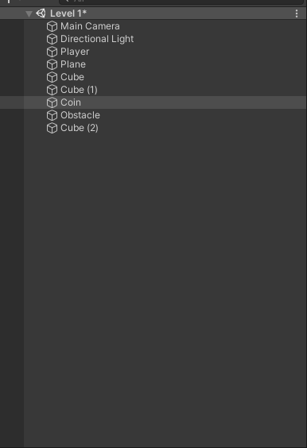
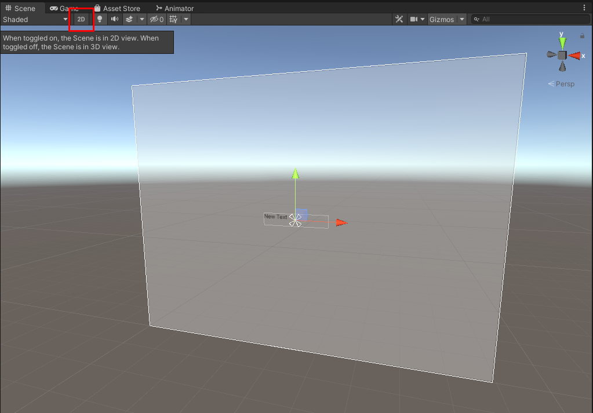
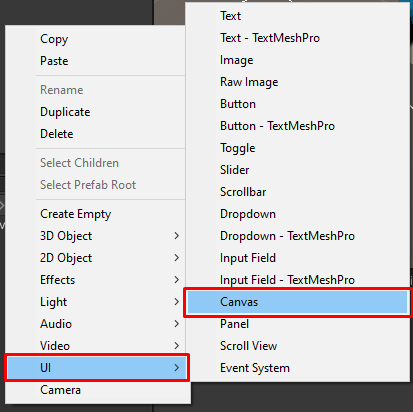

# Modul-Game-Dev-2-LBE-GIGa

## Prefab
Apa itu prefab?
Prefab adalah asset berupa game object yang dapat digunakan kembali. Dengan ini game object dapat di-*sync* pada beberapa scene. Saat kita membuat object dalam unity, game object tersebut mempunyai component yang berbeda dan setiap component tersebut mempunyai value yang berbeda. Ini membuat game object dalam unity bisa kita ubah tanpa berefek ke game object lainnya.

Akan tetapi, terkadang kita ingin beberapa game object untuk mempunyai component sama dan value component yang sama pada *multiple scenes*. Sebagai contoh, coin mempunyai fungsi yang sama, grafik yang sama pada semua scene. Jika kita ingin mengubah suatu warna dari coin, kita ingin semua coin untuk mengikuti perubahan warna tersebut. Inilah guna prefab.

### Cara membuat prefab
Untuk membuat prefab, kita dapat men-*drag* game object yang mau kita buat jadi prefab ke project tab. Game object akan otomatis berubah menjadi biru, ini berarti game object tersebut merupakan prefab. Dalam project tab juga terdapat asset berwarna biru yang sudah kita buat.

sebelum prefab



setelah prefab


Kita *organize* prefab yang sudah kita buat dengan membuat folder prefab dan memasukkan object tersebut di folder tersebut.


### Cara menggunakan prefab
Untuk menggunakan prefab, kita tinggal men-*drag* object yang ada di project tab, kedalam scene view. Dengan ini, akan ada 2 *instance* yang mempunyai template object yang sama.

### Cara mengubah prefab

#### Mengubah perfab dalam suatu scene
Dalam prefab unity, kita dapat melakukan perubahan local pada prefab. Artinya perubahan ini tidak akan mengubah game object dengan prefab yang sama. Caranya adalah dengan mengubah game object tersebut pada suatu scene. Secara default perubahan prefab dalam suatu scene tidak akan merubah game object dengan prefab lainnya.

Untuk melakukan *update* pada game object lainnya, kita harus menekan tombol override lalu apply-all. Disini kita juga dapat melakukan revert terhadap perubahan local yang sudah kita buat. Yaitu dengan override lalu revert-all.


#### Mengubah prefab asset file
Salah satu cara lagi yang dapat kita gunakan untuk mengubah prefab adalah dengan menge-*klik* 2 kali prefab dalam project view. Ini merupakan fitur baru dalam unity, dengan ini kita dapat mengupdate semua game object prefab dengan mengubah asset filenya secara langsung.

## Membuat camera mengikuti player
Untuk memudahkan camera tracking. Kita akan menggunakan pre-*built* package yaitu Cinemachine. Untuk menginstallnya dapat ke window -> package manager -> Cinemachine -> Install.

Setelah instalasi selesai, kita dapat menggunakan cinemachine dengan ke cinemachine -> Create Virtual Camera. Akan otomatis terbuat object bernama CM vcam. Ini akan menjadi object camera kita.

Posisikan object CM Vcam sesuai dengan gambar berikut.

Pada attribut follow, *drag and drop* game object player. Lalu ubah binding mode menjadi world space. Atur offset sesuai dengan keinginan. Alasan binding mode kita ubah menjadi world space adalah kita tidak ingin camera berotasi sesuai dengan player. Akan tetapi kita tetap ingin camera mengikuti player dengan offset yang tepat. Kalian dapat mencoba men-*tweek* setting camera sesuai dengan keinginan kalian.


## Membuat Scene Main Menu
Dalam game tentu mempunyai main menu. Untuk membuatnya, kita perlu belajar scene.

### Apa itu scene?
Scene adalah object dimana kita bisa menaruh game object, ui, menus dalam game kita. Scene dapat kita anggap sebagai suatu level. Dalam suatu scene, kita dapat membuat game object, UI, particle system dan game object lainnya.

### Membuat scene
Untuk membuat scene kita dapat membuat scene dengan klik kanan di project tab, lalu Create -> Scene. Setelah itu beri scene tersebut nama "Main Menu". Untuk membuat project kita tetap teroganisir, kita masukkan semua object scene dalam folder scenes.


### Mengedit scene
Untuk mengedit suatu scene, kita dapat double-click scene tersebut dalam project tab. Scene akan otomatis ter-*load* dalam scene view.

### Belajar UI
Untuk membuat user interface unity sudah memberikan beberapa component untuk memudahkan kita. Berikut adalah beberapa komponen yang dapat digunakan. Untuk memudahkan pembuatan ui klik 2d mode.



#### Membuat canvas
Canvas, sesuai namanya akan menjadi tempat kita akan me-*render* komponen ui. Artinya semua yang diluar canvas akan tidak dirender oleh canvas. Untuk membuat canvas, click kanan di hierarchy, lalu pilih UI > Canvas.



#### Membuat panel
Panel, digunakan untuk menyusun ui dalam unity. Dalam suatu main menu, misalkan akan ada panel main, panel lobby, panel settings, dan panel-panel lainnya. Untuk membuat panel, klick kanan di game object canvas, lalu pilih UI > Panel. Beri panel tersebut nama "Main menu".


#### Membuat Text UI
Text, digunakan untuk menampilkan tulisan dalam ui unity. Untuk membuat text, klik kanan di hierarchy, lalu pilih UI > Text. Dalam inspector, kita dapat mengubah text, allignment, font dll.


#### Membuat Button UI
Button, digunkan untuk memberikan tombol dalam ui unity. Untuk membuat button, klik kanan di hierarchy, lalu pilih UI > Button. Secara default button akan mempunyai child object dengan komponen text. Jadi untuk mengubah tulisan dalam button, kita akan mengubahnya dalam object text yang menjadi child game object button.


### Membuat main menu
Buatlah UI main menu seperti berikut.


Setelah itu buatlah script bernama MainMenu.cs. Lalu ketikkan kode berikut.
```cs
using UnityEngine;
using UnityEngine.SceneManagement;
using System.Collections;

public class MainMenu : MonoBehaviour {

	public void Play() {
		SceneManager.LoadScene("Level 1");
	}
	
	public void Quit() {
		Application.Quit();
	}

}
```

**NOTE : "Level 1" merupakan nama scene level yang sudah kita buat.**

Setelah itu pada panel game object bernama "Main Menu" dan pasang script tersebut.

Selanjutnya pada object play button. Tambahkan fungsi Play di Game Object Main Menu tadi pada event OnClick.


Lakukan hal yang sama pada object quit button. Akan tetapi tambahkan fungsi Quit di Game Object Main Menu pada event OnClick.

Selanjutnya kita harus menambahkan scene ini pada build setting. Buka build settings dengan masuk ke File > Build Settings...


Urutan scene akan menentukan bagaimana cara kita memulai aplikasi. Scene yang berada di paling atas, adalah yang akan paling pertama muncul. Akan tetapi, selanjutnya kita bisa men-*load* scene lain dengan ```SceneManager.LoadScene```.

Untuk menambahkan scene, dapat menggunakan tombol add open scene atau menggunakan *drag and drop* scene di project tab ke area berikut.


Pada konfigurasi ini, scene Main Menu akan dijalankan saat aplikasi baru mulai. Scene Main Menu dapat dicoba sekarang.


Jika kita menekan Play kita akan langsung ke scene level 1. Akan tetapi tombol quit tidak akan bekerja pada editor dan hanya akan bekerja setelah aplikasi kita build.

## Membuat HUD
Menggunakan ilmu yang tadi kita pelajari, buatlah ui seperti berikut pada scene "Level 1".


Dengan hierarchy seperti berikut.

Selanjutnya buat script bernama HUDCoin.cs dan tuliskan kode berikut.

```cs
using UnityEngine;
using UnityEngine.UI;
using System.Collections;

public class HUDCoin : MonoBehaviour {

	private Player player;

	private Text text;

	void Start() {
		text = GetComponent<Text>();
		player = FindObjectOfType<Player>();
	}
	
	void Update() {
		text.text = "Koin : " + player.Coin;
	}
}

```

FindObjectOfType akan mencari dalam scene tersebut object dengan tipe class tersebut. Sangat tidak disarangkan untuk digunakan saat banyak object dalam scene.

Jalankan game tersebut, maka text coin akan bertambah saat player mengambil coin.

## Membuat Game Over Menu
Buatlah menu seperti berikut.


Buatlah script GameOverMenu.cs lalu ketikkan kode berikut
```cs
using UnityEngine;
using UnityEngine.UI;
using UnityEngine.SceneManagement;
using System.Collections;

public class GameOverMenu : MonoBehaviour {

	[SerializeField] private Text text;

	private void Start() {
		Hide();
	}

	public void Show() {
		gameObject.SetActive(true);
	}

	public void Retry() {
		SceneManager.LoadScene(SceneManager.GetActiveScene().buildIndex);
	}

	public void MainMenu() {
		SceneManager.LoadScene("Main Menu");
	}

	public void SetScore(int score) {
		text.text = "Koin : " + score;
	}

	public void Hide() {
		gameObject.SetActive(false);
	}
}

```

Lalu pasangkan fungsi retry dan main menu ke button masing-masing.

Pada script Obstacle.cs ubah kodenya menjadi berikut.

```cs
using UnityEngine;
using UnityEngine.SceneManagement;
using System.Collections;

public class Obstacle : MonoBehaviour {

	private void OnTriggerEnter(Collider other) {
		Player player = other.GetComponent<Player>();
		if(player != null) {
			GameOverMenu gameOverMenu = FindObjectOfType<GameOverMenu>();
			gameOverMenu.SetScore(player.Coin);
			gameOverMenu.Show();
			Destroy(player.gameObject);
		}
	}

}
```

Dengan ini object game over menu akan ditampilkan saat player terkena obstacle.

## TO DO
1. Sekarang jika player jatuh dari plane, tidak akan game over. Buat agar player game over saat jatuh dari plane.
2. Coba buat level baru dan buat agar jika kita memenangkan level sekarang, pindah ke level selanjutnya.
3. Coba buat menu yang akan tampil jika kita memenangkan level dengan tombol next. Yang jika kita tekan pindah ke level selanjutnya.

## References
https://docs.unity3d.com/Manual/Prefabs.html
https://docs.unity3d.com/Manual/CreatingScenes.html